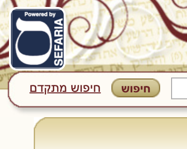
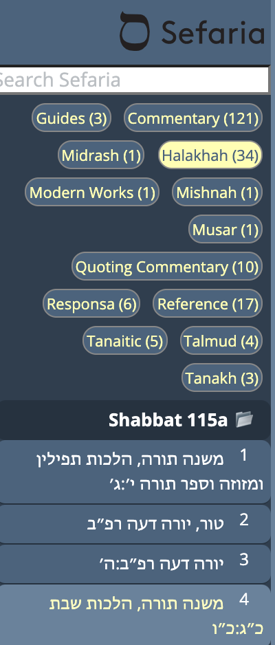
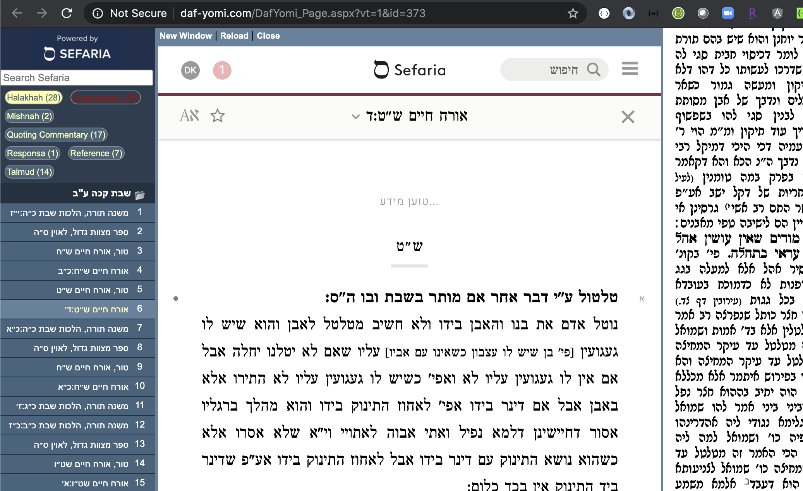
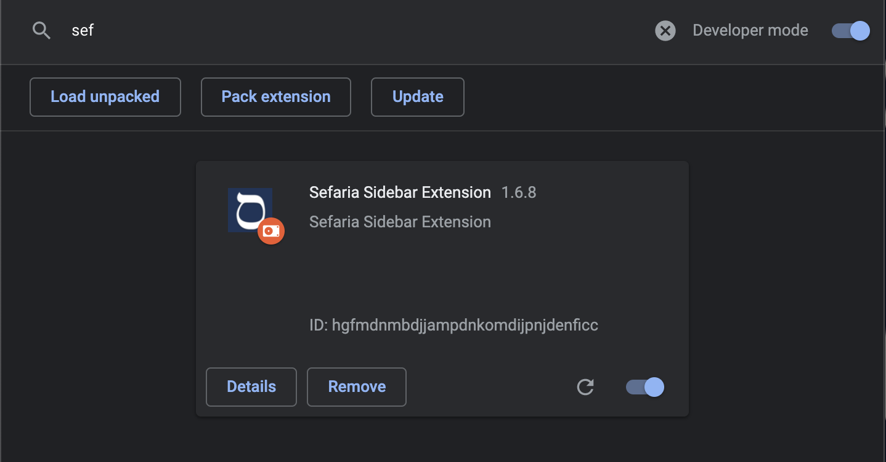

# Sefaria Sidebar Chrome Extension

- [Demo (Video)](#demo--video-)
- [Example Screenshots](#example-screenshots)
- [Installation Instructions](#installation-instructions)
- [Packaging for the google extension store](#packaging-for-the-google-extension-store)

Simple Chrome extension to display a sidebar with key references that are relevant to the webpage.

At the present moment, this is a prototype designed to work with Daf Yomi pages that are on a specific Daf.

Current sites supported:
   * YUTorah.org
   * OUTorah.org
   * AllDaf.com
   * Daf-yomi.com (hebrew portal daf yomi)
   * E-Daf.com
   * Daf HaChaim.org
   * Steinsaltz-center.org - English Daf Yomi PDFs
   * RealClearDaf.com
   * Hadran.org.il
   
Ultimately the aim is to crowdsource other websites where it's possible to recognize identity of elements on the page.  This may also be useful to replace the Sefaria Linker button which could now run automatically on whitelisted webpages, and leverage the sidebar for enhanced display.


# Demo (Video)

[](https://www.youtube.com/watch?v=MguSzMFEqF8)
 
# Example Screenshots 







# Installation Instructions

To install and develop this:

1.  Clone the repo
   ```
   git clone https://github.com/DovOps/SefariaSidebarExtension.git
   ```
1. In google chrome, go to chrome://extensions, and 'Enable Developer Mode'. (See below for a screen shot)

1. Click 'Load Unpacked' to load a chrome extension via its source code directory

1. Select the main 'SefariaSidebarExtension' root folder of this repo on your filesystem and hit 'OK' 

1. Reminder: If you have the actual Chrome webstore extension enabled, you must disable it so you don't have this running twice!

1. As you make modifications to the code, you will need to revisit chrome://extensions and click the 'Refresh' Arrow icon on this extension as listed



# Packaging for the Chrome Extension Marketplace

1. You must bump up the version in the manifest.json which Google Extension Store expects for updated packages
1. Packaging this is as simple as zipping up the source directory. (I delete .git and README from the directory before zipping)
1. This is then uploaded to the Chrome developer dashboard (right now I'm the only person who can do this)
1. The goal is to move this to a CI/CD pipeline - but I'm not sure we want to publish to the store on every build as there's an approval prcess which takes up to 2 days based on experience

The Google Store listing is  https://chrome.google.com/webstore/detail/sefaria-sidebar-extension/dmpiiciebnbekblfbcdeogjkbbmeeimi?hl=en-US&authuser=0

