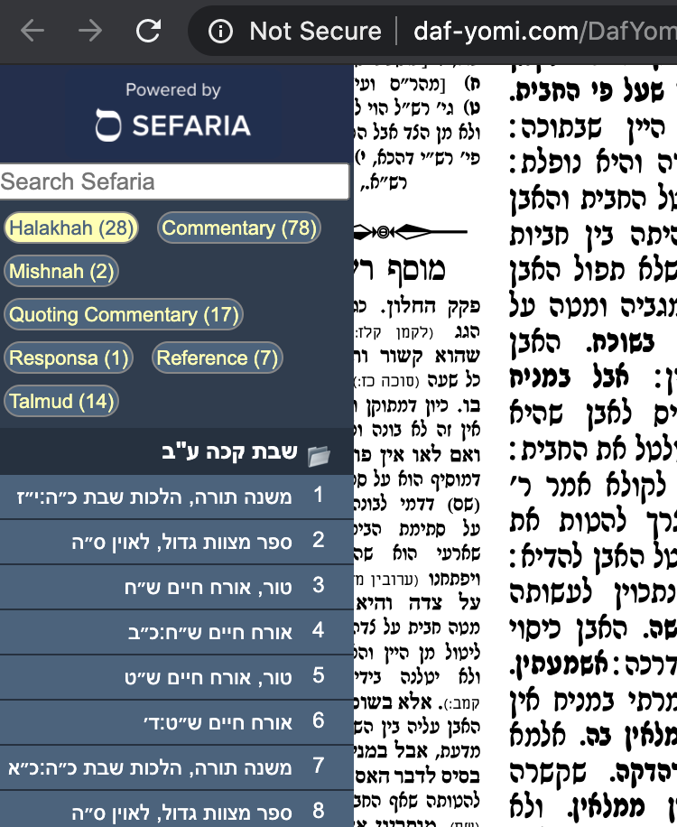

# Sefaria Sidebar Chrome Extension

Simple Chrome extension to display a sidebar with key references that are relevant to the webpage.

At the present moment, this is a prototype designed to work with Daf Yomi pages that are on a specific Daf.

Current sites supported:
   * YUTorah.org
   * OUTorah.org
   * AllDaf.com
   * Daf-yomi.com (hebrew portal daf yomi)
   * E-Daf.com
   * Daf HaChaim.org
   * Steinsaltz-center.org - English Daf Yomi PDFs
   * RealClearDaf.com
   * Hadran.org.il
   
Ultimately the aim is to crowdsource other websites where it's possible to recognize identity of elements on the page.  This may also be useful to replace the Sefaria Linker button which could now run automatically on whitelisted webpages, and leverage the sidebar for enhanced display.

# Demo (Video)

 
# Example Screenshots 

